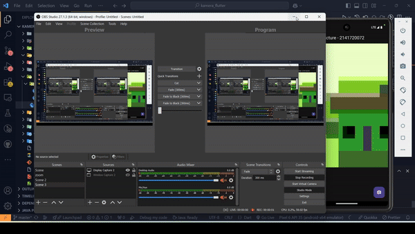
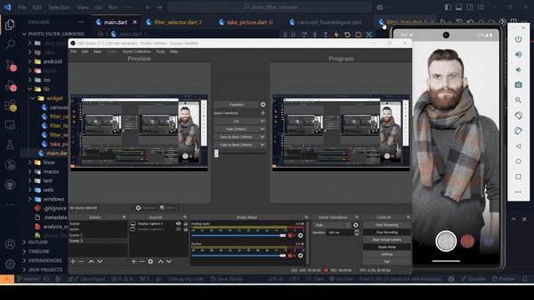
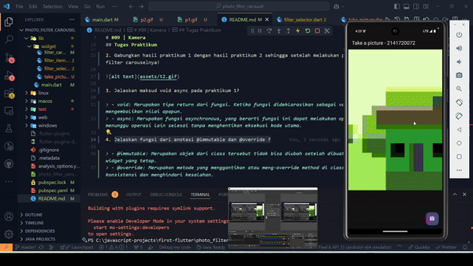

Nama    : Halur Muhammad Abiyyu

Kelas   : TI - 3H

NIM     : 2141720072

# #09 | Kamera

## Praktikum 1: Mengambil Foto dengan Kamera di Flutter

## Praktikum 2: Membuat photo filter carousel

## Tugas Praktikum
1. Selesaikan Praktikum 1 dan 2, lalu dokumentasikan dan push ke repository Anda berupa screenshot setiap hasil pekerjaan beserta penjelasannya di file README.md! Jika terdapat error atau kode yang tidak dapat berjalan, silakan Anda perbaiki sesuai tujuan aplikasi dibuat!

> - [Praktikum 1](https://github.com/halurabiyyu/kamera_flutter)
> - [Praktikum 2](https://github.com/halurabiyyu/photo_filter_carousel)

2. Gabungkan hasil praktikum 1 dengan hasil praktikum 2 sehingga setelah melakukan pengambilan foto, dapat dibuat filter carouselnya!

3. Jelaskan maksud void async pada praktikum 1?

> - void: Menunjukkan bahwa fungsi tersebut tidak mengembalikan nilai apa pun. Fungsi ini melakukan operasi tanpa mengembalikan hasil ke pemanggilnya.
> - async: Menyatakan bahwa fungsi tersebut berjalan secara asinkron. Artinya, fungsi dapat menjalankan tugas yang membutuhkan waktu (seperti pemanggilan API, menunggu proses I/O, atau delay) tanpa menghentikan eksekusi kode lainnya. Kata kunci async juga memungkinkan penggunaan await di dalam fungsi untuk menunggu hasil operasi asinkron lain sebelum melanjutkan.

4. Jelaskan fungsi dari anotasi @immutable dan @override ?

> - @immutable: Menandakan bahwa kelas tidak dapat diubah setelah dibuat. Semua properti harus bersifat final.
> - @override: MMenunjukkan bahwa metode tersebut menggantikan metode dari kelas induk. Berguna untuk memastikan bahwa metode sesuai dengan kelas induknya dan membantu menghindari kesalahan saat terjadi perubahan di kelas induk.